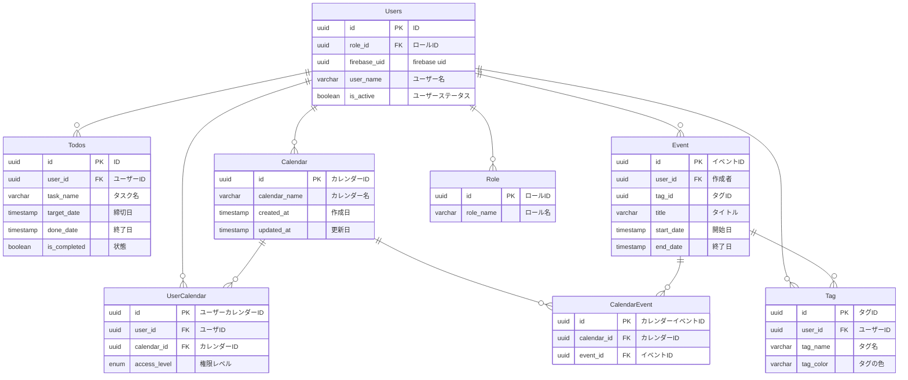

# Task-Copilot ER 図

```mermaid
---
title: ""
---
erDiagram
    Users ||--o{ Todos  : ""
    Users ||--o{ Calendar  : ""
    Users ||--o{ Event  : ""
    Users ||--o{ Role  : ""
    Users ||--o{ Tag  : ""
    Users ||--o{ UserCalendar  : ""

    Calendar ||--o{ UserCalendar : ""
    Calendar ||--o{ CalendarEvent : ""

    Event ||--o{ Tag : ""
    Event ||--o{ CalendarEvent : ""


    Users {
      uuid id PK "ID"
      uuid role_id FK "ロールID"
      uuid firebase_uid "firebase uid"
      varchar user_name "ユーザー名"
      boolean is_active "ユーザーステータス"
    }

    Todos {
      uuid id PK "ID"
      uuid user_id FK "ユーザーID"
      varchar task_name "タスク名"
      timestamp target_date "締切日"
      timestamp done_date "終了日"
      boolean is_completed "状態"
    }

    Calendar {
      uuid id PK "カレンダーID"
      varchar calendar_name "カレンダー名"
      timestamp created_at "作成日"
      timestamp updated_at "更新日"
    }

    Event {
      uuid id PK "イベントID"
      uuid user_id FK "作成者"
      uuid tag_id "タグID"
      varchar title "タイトル"
      timestamp start_date "開始日"
      timestamp end_date "終了日"
    }

    Role {
      uuid id PK "ロールID"
      varchar role_name "ロール名"
    }

    Tag {
      uuid id PK "タグID"
      uuid user_id FK "ユーザーID"
      varchar tag_name "タグ名"
      varchar tag_color "タグの色"
    }

    UserCalendar {
      uuid id PK "ユーザーカレンダーID"
      uuid user_id FK "ユーザID"
      uuid calendar_id FK "カレンダーID"
      enum access_level "権限レベル"
    }

    CalendarEvent {
      uuid id PK "カレンダーイベントID"
      uuid calendar_id FK "カレンダーID"
      uuid event_id FK "イベントID"
    }

```
